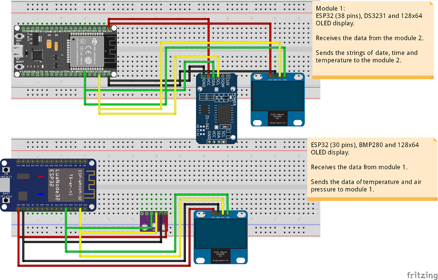
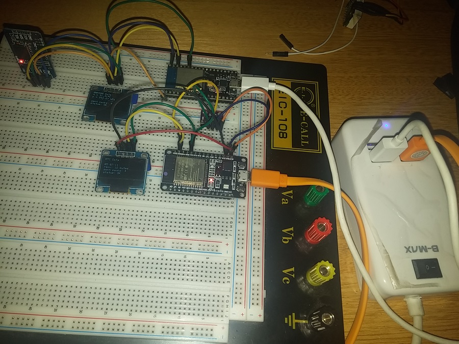

# Using ESP-NOW with ESP32       
       

 - This project is a modification of this project: https://randomnerdtutorials.com/esp-now-two-way-communication-esp32/     
 - This project is a example of making a **TWO-WAY COMMUNICATION** using the **ESP-NOW** protocol, using **TWO ESP32 boards**.      
       

# Parts required:      	 
 - NodeMCU ESP32 boards - x2     
 - ZS-042 RTC module (with the DS3231 RTC) - x1       
 - BMP280 sensor module (temperature and air pressure) - x1     
      

# Sketches:      
 - **`Module_01_ESP-NOW_TwoWayCom`**: Sketch uploaded to the first ESP32 module.     
	- Receives the data of temperature and pressure from Module 2.     
	- Sends to module 2 the data os date, time and temperature (read on the RTC module).      
 - **`Module_02_ESP-NOW_TwoWayCom`**: Sketch uploaded to the second ESP32 module.     
	- Receives the data of date, time and temperature from module 1.   
	- Sends to module 1 the data of temperature and air pressure (read on the BMP280 module).      
	

# Schematic Diagram:      
       
       

# Project running:       
       
	 

